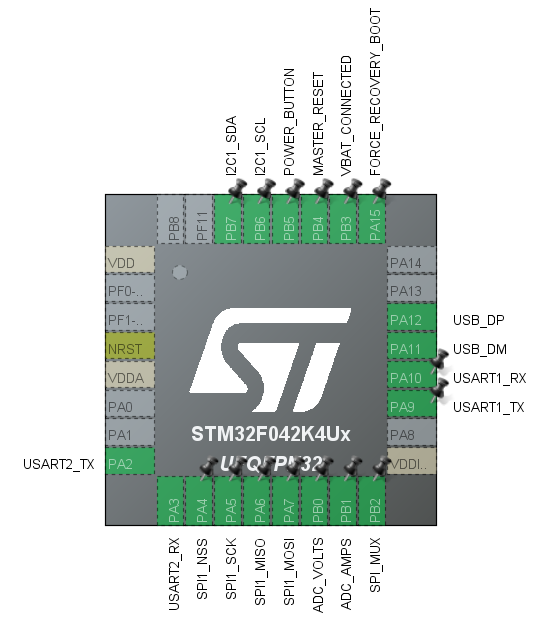

# SolidRun-BMC

This is a BMC (Baseboard Management Controller) Implementation for the SolidRun ARM servers HoneyComb and ClearFog
Management Controllers.

The generic version firmware, using a NUCLEO-F042K6, can be found in a seperate repo 
[STM32-BMC](https://gitext.elektrobitautomotive.com/the78mole/STM32-BMC)

The pin assignment for the SolidRun BMC is as follows:



Here is some table, designating the Signals, the Pin and their function in this project.

| Signal Name           | Pin  | Default | IO Type | Description                                                                                                     |
|-----------------------|------|---------|---------|-----------------------------------------------------------------------------------------------------------------|
| USB_DP                | PA12 | -       | SF      | USB Data +                                                                                                      |
| USB_DM                | PA11 | -       | SF      | USB Data -                                                                                                      |
| POWER_BUTTON          | PB5  | HIGH    | OD      | Connected in parallel to the Power Button (pulls down to GND when active)                                       |
| MASTER_RESET          | PB4  | HIGH    | OD      | Connected in parallel to the Reset Button (pulls down to GND when active)                                       |
| VBAT_CONNECTED        | PB3  | HIGH    | PP      | Switches the connection from battery to RTC on or off (could clear the boards NVM ?)                            |
| FORCE_RECOVERY_REBOOT | PA15 | HIGH    | OD      | Will instruct the board to start the recovery image (maybe parallel to a jumper, pulls down to GND when active) |
| SPI_MUX               | PB2  | LOW     | PP      | Switches the SPI-Flash from Main Processor to Mgmt MCU to access it e.g., for Firmware update                   |
| UART1_TX              | PA9  | -       | SF      | This is the TX of a UART1 that could be the forwarded to the USB CDC 1 endpoint                                 |   
| UART1_RX              | PA10 | -       | SF      | This is the RX of a UART1 that could be the forwarded to the USB CDC 1 endpoint                                 | 
| VCP_TX                | PA2  | -       | SF      | This is the TX of a UART2 that could be the forwarded to the USB CDC 2 endpoint                                 | 
| VCP_RX                | PA3  | -       | SF      | This is the RX of a UART2 that could be the forwarded to the USB CDC 2 endpoint                                 | 
| ADC_VOLTS             | PB0  | -       | AI      | This is the voltage sensing input (not used on Nucleo) The relation is 100 LSB / 1 V (0.01)                     |
| ADC_AMPS              | PB1  | -       | AI      | This is the current sensing input (not used on Nucleo) The relation is 155 LSB / 1 A (0.00645)                  |

The IO Types are as follows:

  - SF -> Special Function
  - OD -> Open Drain (external Pull-Up)
  - PP -> Push-Pull
  - AI -> Analog Input (connected to an ADC-Channel)

## Main functionality

The main purpose of the BMC is to control basic board functions remotely. 
Therefore, you need to connect the USB to some master control unit. The easiest way to control it is simply using a
serial termial e.g., `screen /dev/ttyACM1 115200` (if connected on `ttyACM1`).

The commands are dead simple and single char only (defined in `Core/Src/user.c`):

| Char | Function                                                                      |
|------|-------------------------------------------------------------------------------|
| `R`  | Activate reset signal (= pushing the reset button)                            |
| `r`  | Release reset signal  (= releasing the reset button)                          |
| `P`  | Activate power signal (= pushing the power button)                            |
| `p`  | Release power signal (= releasing the power button)                           |
| `B`  | Activate recovery boot signal (= setting a jumper ???)                        |
| `b`  | Release recovery boot signal (= releasing a jumper ???)                       |
| `a`  | Get the analog values (optional, can be switched of in main.h FEATURE_ANALOG) |

If you issue a command, the controller will respond with `Command: OK` if it was succesful and with 
`Command: FAIL` if not. Usually there can not much go wrong :-) For ADC, it currently reports `Measurement: NIY OK` 
meaning Not-Implemented-Yet.

An example program on the host could look like the following(untested) e.g., to reset the ARM server:

    $ ./tool R /dev/ttyACM1   # --> the server will go to reset
    $ # Wait for a second
    $ ./tool r /dev/ttyACM1   # --> The server will come out of reset

...in Python:
```python
import sys
import serial
import time

def main():
    if len(sys.argv) != 3:
        print(f"Usage: {sys.argv[0]} <character> <serial_port>")
        sys.exit(1)

    ch = sys.argv[1]
    serial_port = sys.argv[2]

    ser = serial.Serial(serial_port, 115200, timeout=5)

    ser.write(ch.encode())

    response = ser.readline().decode().strip()

    if "OK" in response:
        print(f"Received OK: {response}")
        ser.close()
        sys.exit(0)
    else:
        print(f"Did not receive OK: {response}")
        ser.close()
        sys.exit(1)

if __name__ == "__main__":
    main()
```

...in bash
```bash
#!/bin/bash

if [ "$#" -ne 2 ]; then
    echo "Usage: $0 <character> <serial_port>"
    exit 1
fi

character="$1"
serial_port="$2"

stty -F "$serial_port" 115200

echo -n "$character" > "$serial_port"

response=$(head -n 1 < "$serial_port")

if [[ "$response" == *"OK"* ]]; then
    echo "Received OK: $response"
    exit 0
else
    echo "Did not receive OK: $response"
    exit 1
fi
```
...in C:
```c
#include <fcntl.h>
#include <stdio.h>
#include <stdlib.h>
#include <string.h>
#include <termios.h>
#include <unistd.h>

int configure_serial_port(int fd) {
    struct termios tty;

    if (tcgetattr(fd, &tty) != 0) {
        perror("tcgetattr");
        return -1;
    }

    cfsetospeed(&tty, B115200);
    cfsetispeed(&tty, B115200);

    tty.c_cflag |= (CLOCAL | CREAD);
    tty.c_cflag &= ~PARENB;
    tty.c_cflag &= ~CSTOPB;
    tty.c_cflag &= ~CSIZE;
    tty.c_cflag |= CS8;

    tty.c_lflag &= ~(ICANON | ECHO | ECHOE | ISIG);
    tty.c_iflag &= ~(IXON | IXOFF | IXANY);

    tty.c_cc[VMIN] = 1;
    tty.c_cc[VTIME] = 5;

    if (tcsetattr(fd, TCSANOW, &tty) != 0) {
        perror("tcsetattr");
        return -1;
    }

    return 0;
}

int main(int argc, char *argv[]) {
    if (argc != 3) {
        printf("Usage: %s <character> <serial_port>\n", argv[0]);
        return 1;
    }

    char ch = argv[1][0];
    char *serial_port = argv[2];

    int fd = open(serial_port, O_RDWR | O_NOCTTY | O_SYNC);
    if (fd < 0) {
        perror("open");
        return 1;
    }

    if (configure_serial_port(fd) < 0) {
        close(fd);
        return 1;
    }

    if (write(fd, &ch, 1) != 1) {
        perror("write");
        close(fd);
        return 1;
    }

    char response[128];
    ssize_t bytes_read = read(fd, response, sizeof(response) - 1);
    if (bytes_read < 0) {
        perror("read");
        close(fd);
        return 1;
    }
    response[bytes_read] = '\0';

    if (strstr(response, "OK") != NULL) {
        printf("Received OK: %s\n", response);
        close(fd);
        return 0;
    } else {
        printf("Did not receive OK: %s\n", response);
        close(fd);
        return 1;
    }
}
```

## Installing the firmware

Prerequisites:
  
  - [elf2dfuse](https://github.com/majbthrd/elf2dfuse)
  - [dfu-util]((https://dfu-util.sourceforge.net/))

Somehow, using STM32CubeProgrammer is not able to use DFU to install the firmware. It is complaining about some readout 
protection. So we need to use the dfu-util for linux, usually available on many linux distributions.

First is to compile the STM32 project (in Release mode), then 

```
# to convert the elf to a dfu file
$ elf2dfuse SolidRun-BMC.elf SolidRun-BMC.dfu

# To flash the firmware to the BMC MCU (the Jumper J5017 must be set)
$ sudo dfu-util -D SolidRun.dfu

# To get from USB Bootloader to the firmware (e.g. after a power outtage)
$ sudo dfu-util  -a 0 -s 0x08000000:leave

## ToDos and features

  - Impelement a reset function to boot into Bootloader from Application
  - Do not depend on J5017 anymore to do firmware upgrades (this is usually populated)
  - Add a watchdog
  - Clean up sources to free a bit of memory for additional function
  - Fix the analog readout of voltage and current :-)
